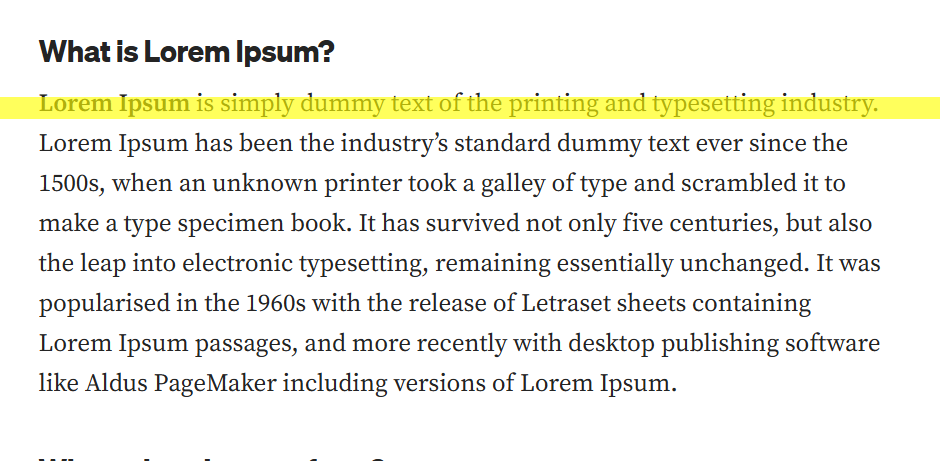

# Reading Bar Follower

A lightweight Chrome extension that adds a customizable reading bar overlay to webpages, enhancing focus and improving the reading experience.

## Features

- **Dynamic Reading Bar**: Follows your cursor's Y position to guide your reading.
- **Customizable Styles**:
  - Bar color
  - Opacity
  - Height
  - Smooth following behavior with adjustable speed
- **Toggle Visibility**: Easily enable or disable the reading bar.
- **Responsive Design**: Adapts to window resizing and ensures seamless integration.

## Installation

1. Download or clone the repository.
2. Open the Chrome browser and navigate to `chrome://extensions`.
3. Enable **Developer Mode** (toggle in the top-right corner).
4. Click **Load Unpacked** and select the extracted folder of this project.
5. The extension is now ready to use!

## Usage

1. Click the extension icon to open the popup interface.
2. Adjust the settings to customize the reading bar:
   - Enable or disable the bar.
   - Set the color, opacity, height, and smooth follow options.
3. Move your mouse over the webpage to see the reading bar in action.

## Permissions

This extension requires the following permissions:
- **Active Tab**: To inject the reading bar into the active webpage.
- **Storage**: To save your customization preferences.
- **Scripting**: To dynamically apply the reading bar functionality.

## Development

To modify or improve the extension:
1. Make your changes in the source files (`content.js`, `styles.css`, etc.).
2. Reload the unpacked extension in Chrome to see the updates.

## Contributing

We welcome contributions! Feel free to fork the repository and submit a pull request.

## License

This project is licensed under the [MIT License](LICENSE).

---

### Screenshots

